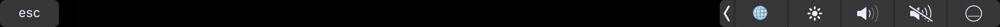

TouchBar Ping Application
===================

Hey guys ! I just made an application which add an entry into the controls strip zone into the touchbar (Macbook pro 2016 editions).

The application's goal is to display in the touchbar at any time : The SSID, the RSSI and the latency you have on your wifi connection (display is refreshed every second)

----------

DFRFoundation Framework
-------------

To inject code into the Control Strip zone in the touchbar, you have to use a private Apple framework. That's why there is no documentation on the web made by Apple. 

First,  you have to link the library/fmwk located at "/System/Library/PrivateFrameworks/DFRFoundation.framework" 
Why this library ? Because we can see it exposes functions which deal with ControlStrip 

> MBP-de-Crayer:Touchbar-PingApp crayer$ nm /System/Library/PrivateFrameworks/DFRFoundation.framework/DFRFoundation | grep Strip
000000000000b8d0 S _DFRControlStripPlayPauseButtonIdentifier
0000000000002d8a T _DFRControlStripRegisterEndpoint
000000000000b660 s _DFRControlStripRegisterEndpoint.keys
0000000000005e22 T _DFRElementGetControlStripPresenceForIdentifier
0000000000005e9b T _DFRElementSetControlStripPresenceForIdentifier
000000000000b928 S _DFRProtocolControlStripEndpoint
00000000000073f6 t __DFRControlStripConnection
0000000000007060 t __DFRGetControlStripPID
0000000000002d7c t __DFRIsControlStrip
00000000000070f7 t ___DFRControlStripConnection
00000000000071bf t ___DFRControlStripConnectionHandler
000000000000bbe0 s ___DFRElementSetControlStripPresence.keys
0000000000005f15 t ___DFRElementSetControlStripPresenceForIdentifier_block_invoke
00000000000071b2 t _____DFRControlStripConnection_block_invoke
00000000000082bb t _____DFRSetControlStripEndpoint_block_invoke
000000000000d2c0 b _gControlStripConnection
000000000000d2b8 b _gControlStripOverride
000000000000d2b4 b _gControlStripPID
000000000000d228 b _gDFRIsControlStrip

The result of this command gave us tips about methods to use. And thanks to GitHub community we can use headers (.h file) to use those methods. I recommand you to have a look at my WindowController.swift file to see how to use it. 

